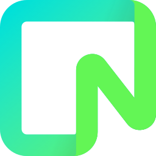

  

  

 

  
  &nbsp;&nbsp;&nbsp;
  &nbsp;&nbsp;&nbsp;
  

 ---
# About Me 👀

I'm a software developer and Web3 enthusiast, driven by continuous learning and growth. Always seeking new challenges to expand my tech skills.

I'm currently learning 🌱:

- ⛓️‍💥**Solidity**: A programming language for writing smart contracts on Ethereum and other blockchains.
- 🐳**Docker**: A platform for automating application deployment using containerization.

 # My Tech Skills ⛩️

  ## Frontend Stack 🎨

&nbsp;&nbsp;&nbsp;
&nbsp;&nbsp;&nbsp;
&nbsp;&nbsp;&nbsp;
&nbsp;&nbsp;&nbsp;
&nbsp;&nbsp;&nbsp;
&nbsp;&nbsp;&nbsp;
&nbsp;&nbsp;&nbsp;

  ## Backend Stack 🧬

  

    
   &nbsp;&nbsp;&nbsp;
   &nbsp;&nbsp;&nbsp;
    &nbsp;&nbsp;&nbsp;
    
  
  

  ## DataBase Stack 📊

  

    
  &nbsp;&nbsp;&nbsp;
  &nbsp;&nbsp;&nbsp;
  

  

  ## Other Tools ⚛️

  
  &nbsp;&nbsp;&nbsp;
  &nbsp;&nbsp;&nbsp;
  &nbsp;&nbsp;&nbsp;
  &nbsp;&nbsp;&nbsp;
  

