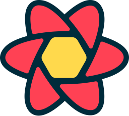
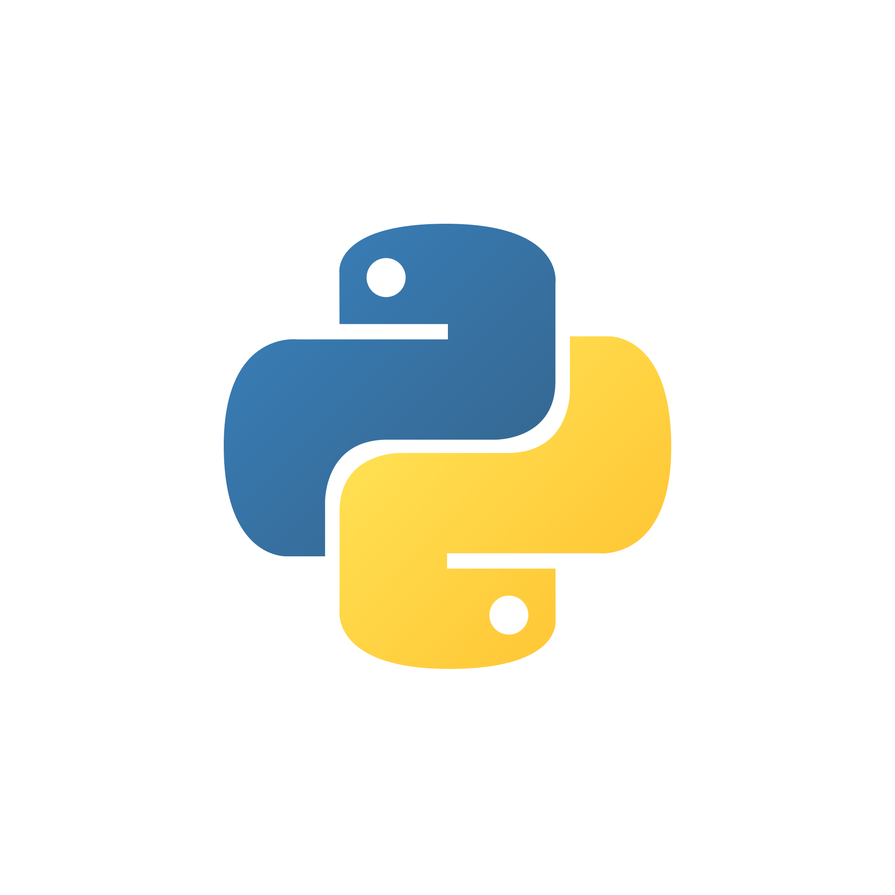
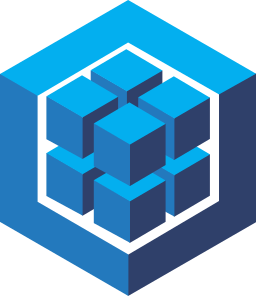
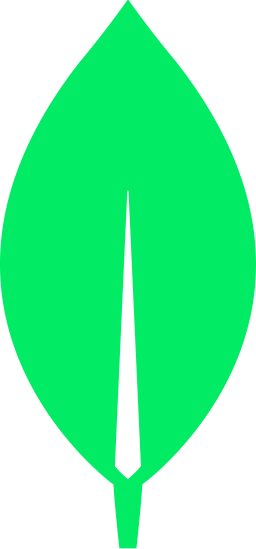
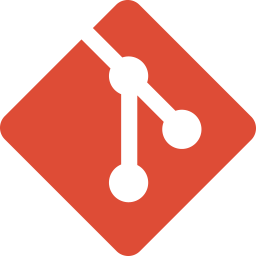

  </h1>

 

I'm a Software Engineer, Open-Source Contributor, and Web3 Developer. Here on GitHub, you'll find my personal projects alongside my contributions to open-source software projects. I'm deeply passionate about continuous learning and always eager to embrace new challenges that drive my professional growth and technical expertise.

### Let's Connect on Social Media!  👀

&nbsp;&nbsp;&nbsp;
&nbsp;&nbsp;&nbsp;
&nbsp;&nbsp;&nbsp;

---

### What I'm Up To 💡

- 🌍 **Open Source Contributor**: Enhancing software and learning through global collaboration with developers.
- 🦀 **Mastering Rust**: Developing high-performance, memory-efficient applications.
- 🔗 **Exploring Blockchain**: Deepening expertise in blockchain, smart contracts, DeFi and decentralized architectures.

##
 
<h1>My Tech Stack ⛩️ </h1> 

 ## Frontend 🎨
 

&nbsp;&nbsp;&nbsp;
&nbsp;&nbsp;&nbsp;
&nbsp;&nbsp;&nbsp;
&nbsp;&nbsp;&nbsp;
&nbsp;&nbsp;&nbsp;
&nbsp;&nbsp;&nbsp;
&nbsp;&nbsp;&nbsp;
&nbsp;&nbsp;&nbsp;
&nbsp;&nbsp;&nbsp;

  ## Backend 🧬

   &nbsp;&nbsp;&nbsp;
   &nbsp;&nbsp;&nbsp;
   &nbsp;&nbsp;&nbsp;
   &nbsp;&nbsp;&nbsp;
    &nbsp;&nbsp;&nbsp;

  ## DataBase 🔑
 

  

    
  &nbsp;&nbsp;&nbsp;
  &nbsp;&nbsp;&nbsp;
  

  

  ## Development Tools & Workflows 🌀

  &nbsp;&nbsp;&nbsp;
  &nbsp;&nbsp;&nbsp;
  &nbsp;&nbsp;&nbsp;
  &nbsp;&nbsp;&nbsp;
  &nbsp;&nbsp;&nbsp;
  &nbsp;&nbsp;&nbsp; 

