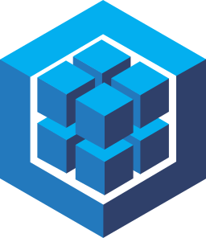

 # Hello There! I'm Kevin Latino 👋🏽

 

I'm a Software Developer, Open-Source Contributor and Web3 Enthusiast. Here on my GitHub, you can explore my projects and contributions to Open-Source Blockchain Projects. I'm passionate about learning and constantly seek new challenges to further my professional growth and expertise.

### Let's Connect on My Social Media!  👀

&nbsp;&nbsp;&nbsp;
&nbsp;&nbsp;&nbsp;
&nbsp;&nbsp;&nbsp;

---

 # My Tech Skills ⛩️

  ## Frontend Stack 🎨
 

&nbsp;&nbsp;&nbsp;
&nbsp;&nbsp;&nbsp;
&nbsp;&nbsp;&nbsp;
&nbsp;&nbsp;&nbsp;
&nbsp;&nbsp;&nbsp;

  ## Backend Stack 🧬

    &nbsp;&nbsp;&nbsp;
   &nbsp;&nbsp;&nbsp;
    &nbsp;&nbsp;&nbsp;
    &nbsp;&nbsp;&nbsp;

  ## DataBase Stack 🔑

  

    
  &nbsp;&nbsp;&nbsp;
  &nbsp;&nbsp;&nbsp;
  

  

  ## DevOps and Tools ♾️

  
  &nbsp;&nbsp;&nbsp;
  &nbsp;&nbsp;&nbsp;
  &nbsp;&nbsp;&nbsp;
  &nbsp;&nbsp;&nbsp;
  &nbsp;&nbsp;&nbsp;  

